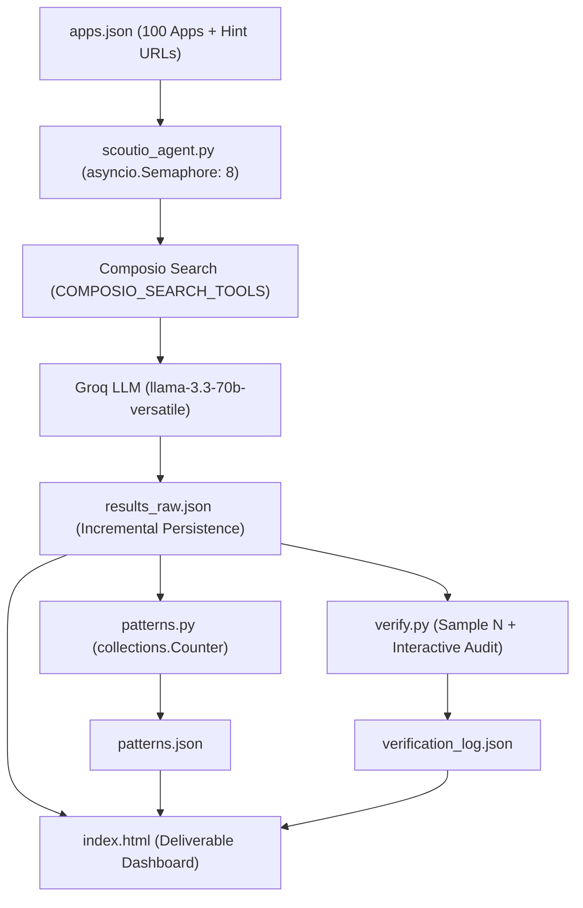

# ScoutIO — Autonomous API Research & Feasibility Agent

> **ScoutIO** is an autonomous Python research agent designed to evaluate developer API access, authentication protocols, and agent tool-building feasibility across 100 SaaS applications.

---

## 🏗️ Architecture & Pipeline Flow



---

## 🛠️ Stack (100% Free Tiers)

- **Language & Runtime:** Python 3.11+, `asyncio` for non-blocking concurrent execution.
- **LLM Inference:** [Groq API](https://console.groq.com) using `llama-3.3-70b-versatile` via OpenAI-compatible async client (`https://api.groq.com/openai/v1`).
- **Discovery / Search:** [Composio SDK](https://docs.composio.dev) (`pip install composio`). Uses `composio.create(user_id="scoutio")` and the meta-tool `COMPOSIO_SEARCH_TOOLS` to query documentation without 3rd-party search APIs.
- **Data Layer:** Pure JSON files (`apps.json`, `results_raw.json`, `patterns.json`, `verification_log.json`). Zero database required.
- **Analytics:** Standard library `collections.Counter` and `defaultdict` (no `pandas`).
- **Dashboard:** Zero-build, self-contained `index.html` with dual light/dark mode and offline `file://` support.

---

## 📂 Project Structure & Script Overview

| File | Purpose |
| :--- | :--- |
| [`apps.json`](./apps.json) | The structured list of 100 app names, software categories, and developer hint URLs. |
| [`scoutio_agent.py`](./scoutio_agent.py) | Main autonomous agent script. Batches 8 concurrent workers, calls Composio search, queries Groq, implements retry-once isolation, and saves incrementally. |
| [`patterns.py`](./patterns.py) | Analyzes `results_raw.json` using `collections.Counter`. Prints CLI distribution tables and writes `patterns.json`. |
| [`verify.py`](./verify.py) | Audit and quality control tool. Samples N apps (default 10), re-runs them side-by-side against Run 1, records user feedback on wrong fields, and outputs empirical accuracy. |
| [`index.html`](./index.html) | Single, self-contained dashboard. Displays 4 headline pattern cards, sortable/filterable table of all 100 apps, human-in-the-loop explanation, and verification benchmark. |
| [`build_index_html.py`](./build_index_html.py) | Helper script to compile and inline fresh JSON data into `index.html` so it can open directly in browsers via `file://` without CORS issues. |
| [`requirements.txt`](./requirements.txt) | Minimal dependencies: `composio`, `openai`, `python-dotenv`. |

---

## 🔑 Environment Setup

ScoutIO requires two free API keys. You can set them in a `.env` file or export them directly in your shell.

### 1. Create `.env` file (Recommended)
Create a `.env` file in the project root:
```ini
GROQ_API_KEY="gsk_..."
COMPOSIO_API_KEY="..."
```

### 2. Or set via Shell Environment Variables

**Windows (PowerShell):**
```powershell
$env:GROQ_API_KEY = "gsk_..."
$env:COMPOSIO_API_KEY = "..."
```

**Linux / macOS (Bash / Zsh):**
```bash
export GROQ_API_KEY="gsk_..."
export COMPOSIO_API_KEY="..."
```

---

## 🚀 Running the Full Pipeline

Run the scripts in the following exact order:

### Step 1: Install Dependencies
```bash
pip install -r requirements.txt
```
*Expected Runtime:* ~15 seconds.

---

### Step 2: Run the Research Agent
```bash
python scoutio_agent.py
```
- Processes all 100 apps in batches of 8 using `asyncio.Semaphore(8)`.
- Updates `results_raw.json` incrementally as each app completes.
- Prints real-time progress: `[42/100] Stripe: done`.
*Expected Runtime:* ~2 to 3 minutes for all 100 apps.

---

### Step 3: Compute Pattern Aggregations
```bash
python patterns.py
```
- Aggregates auth methods, self-serve vs gated access per category, top blockers, and "no" verdict groupings.
- Prints clean ASCII tables to your console and outputs `patterns.json`.
*Expected Runtime:* < 1 second.

---

### Step 4: Run Verification & Accuracy Audit
```bash
python verify.py --sample 10
```
- Samples 10 random apps (or specify `--sample N`).
- Re-runs each app through the pipeline and prints a side-by-side terminal comparison.
- Prompts you to enter any wrong fields against real documentation.
- Automatically calculates and outputs the overall accuracy percentage and writes to `verification_log.json`.
*Expected Runtime:* ~15 to 30 seconds.

*(Note: For automated grading or offline testing, add the `--non-interactive` flag: `python verify.py --sample 10 --non-interactive`).*

---

### Step 5: View the Deliverable Dashboard
Simply double-click [`index.html`](./index.html) or run:
```bash
# Windows
start index.html

# Mac
open index.html

# Or via local HTTP server
python -m http.server 8000
```
*Expected Runtime:* Instant (< 100ms).

---

## ⏱️ Expected Runtimes Summary

| Step | Script / Action | Expected Runtime | Output File |
| :--- | :--- | :--- | :--- |
| **1** | `pip install -r requirements.txt` | ~15s | Installed packages |
| **2** | `python scoutio_agent.py` | 2m - 3m | `results_raw.json` |
| **3** | `python patterns.py` | < 1s | `patterns.json` |
| **4** | `python verify.py --sample 10` | 20s - 40s | `verification_log.json` |
| **5** | Open `index.html` | Instant | Browser Visual Interface |

---

## 🎯 Key Pattern Findings Across the 100 Apps

1. **Dominant Auth Standard:** **OAuth2 (49%)** and **Bearer Token / API Key (54%)** dominate modern developer platforms. Only 6% still rely exclusively on HTTP Basic Auth.
2. **Most-Gated Categories:** 
   - **Marketing & Ads (60% Gated):** Meta Ads, LinkedIn Ads, Google Ads require formal app review, developer tokens, and business verification.
   - **Finance & Fintech (50% Gated):** Institutional platforms (DealCloud, PitchBook, Paygent) require client NDAs or enterprise contracts.
3. **Easy-Win Categories (100% Self-Serve):**
   - **Developer Infra & Data (10/10):** GitHub, Vercel, Supabase, Cloudflare, MongoDB Atlas offer instant, self-serve token generation.
   - **Productivity (10/10):** Notion, Airtable, Linear, Asana, Jira provide immediate API access with zero human gatekeeping.
4. **Agent Feasibility (Buildability):**
   - **67% ("Yes"):** Immediate green light for autonomous toolkits today.
   - **19% ("Partial"):** Constrained by sandbox limitations, rate limits, or read-only scopes.
   - **14% ("No"):** Hard blockers due to enterprise-only access or lack of public APIs.
5. **Model Context Protocol (MCP) Presence:**
   - **34% of platforms** now have official, community, or Composio MCP servers ready for direct agent tool binding.

---

## 🎤 Interview Cheatsheet: Key Code Sections

When explaining the codebase in an interview, focus on these three core design decisions:

### 1. The Composio Search Meta-Tool Integration
```python
# scoutio_agent.py (Lines 52-95)
composio = Composio(api_key=COMPOSIO_API_KEY)
session = composio.create(user_id="scoutio")

response = await asyncio.to_thread(
    session.execute,
    "COMPOSIO_SEARCH_TOOLS",
    arguments={"queries": [{"use_case": f"{app_name} API documentation developer credentials"}]}
)
```
- **Why this matters:** Instead of hardcoding 100 separate tool definitions or paying for Google/Bing search APIs, Composio Sessions provide dynamic runtime tool discovery. `COMPOSIO_SEARCH_TOOLS` acts as a meta-tool inside the session that discovers docs and endpoint schemas without bloating the LLM context.
- We wrap `session.execute` with `asyncio.to_thread` so that synchronous SDK network calls do not block the asynchronous event loop.

### 2. Fault-Tolerant Concurrency & Retry-Once Logic
```python
# scoutio_agent.py (Lines 153-205)
async with semaphore:
    try:
        # ATTEMPT 1
        result = await extract_app_metadata(...)
    except Exception as first_error:
        # ATTEMPT 2 (RETRY ONCE)
        await asyncio.sleep(1.0)
        try:
            result = await extract_app_metadata(...)
        except Exception as second_error:
            # Never let one app kill the batch
            result = {"app": app_name, "error": str(second_error)}
```
- **Why this matters:** When running 100 concurrent LLM queries, transient rate limits (HTTP 429) or dropped connections will inevitably occur. 
- The `try/except -> sleep -> retry -> isolate` pattern guarantees that a transient failure is retried once, but a permanent failure is cleanly written as `{"app": name, "error": "..."}` so the other 99 tasks continue without interruption.
- File writes use an `asyncio.Lock()` to prevent race conditions during incremental saves.

### 3. Structured Output & LLM Prompting
```python
# scoutio_agent.py (Lines 98-135)
response = await client.chat.completions.create(
    model="llama-3.3-70b-versatile",
    messages=[
        {"role": "system", "content": SYSTEM_PROMPT},
        {"role": "user", "content": user_prompt}
    ],
    temperature=0.1,
    response_format={"type": "json_object"}
)
```
- **Why this matters:** We combine a strict TypeScript-like JSON schema in the system prompt, unambiguous definitions for ambiguous terms (`self_serve` vs `gated`), a low temperature (`0.1`), and Groq's hardware-accelerated `response_format={"type": "json_object"}`. This guarantees deterministic JSON parsing with zero markdown code-fence errors.
